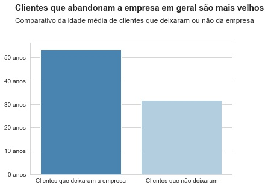
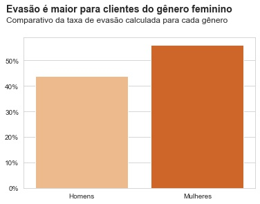

# Previsão de rotatividade de clientes de uma empresa de crédito 

## O problema
Para que uma empresa possa crescer e se desenvolver, é necessário atingir certa massa de clientes que consumam seus produtos e/ou serviços. Os clientes de uma empresa são fundamentais para que ela possa funcionar e mantê-los fiéis é uma tarefa cada vez mais desafiadora para a empresa, já que existe muita facilidade de migração de uma empresa para outra por meio da internet. 

Dessa forma, entender os fatores que influenciam determinado grupo de cliente a abandonar a empresa é algo crucial, assim como estimar se determinado cliente está tendendo a sair da empresa também. Quando possível, estimar a chance de alguém abandonar a empresa possibilita que medidas preventivas sejam tomadas afim de mudar tal realidade, estimulando o cliente a permanecer.

## A solução encontrada
Uma análise exploratória dos dados foi realizada e algumas **características decisivas no fator saída do cliente foram encontradas**. Ademais, **foi sintetizado um bom modelo preditivo** capaz de estimar a chance de determinado cliente sair da empresa.

### Insights
As 05 características mais presentes naqueles que saíram foram:
- **1°:** Idade
- **2°:** Nacionalidade alemã
- **3°:** Genêro feminino
- **4°:** Saldo anual entre 100 a 130 mil
- **5°:** Saldo anual acima de 130 mil	

Com relação a **idade**, boas medidadas que podem previnir a saída de clientes podem ser **investimentos em benefícios para pessoas mais velhas** (seguro de vida, benefício de viagem, etc.) e **maior facilidade de acesso** via meios digitais (app, site, etc.)

Com relação a **nacionalidade alemã**, pode-se pensar em **investimentos de propaganda da empresa no país** assim como também investir na **melhoria do suporte** (verificar feedbacks negativos de clientes alemãos, verificar disponibilidade dos serviços na língua nativa do país, etc.) de produtos e serviços da empresa na região. 

Com relação ao **genêro**, pode-se pensar em **investir em propagandas para o público alvo feminino** e também em **estudos de como criar um ambiente mais agradável** para esse tipo de público, podendo **redefinir alguns conceitos da empresa**.

Com relação ao **saldo**, pode-se investir em **benefícios de rentabilidade** (como fundo de investimentos, etc.) que ofereçam bons resultados para aqueles que possuem maior saldo. Ademais, um fator que pode estar relacionado com a evasão de clientes de alto saldo é a **confiabilidade da empresa**, que pode se abalar com a ocorrência de fraudes e relacionados. Portanto, é interessante pensar também em como aumentar a **confiabilidade e segurança da empresa**.

### Solução preditiva - score de rotatividade

