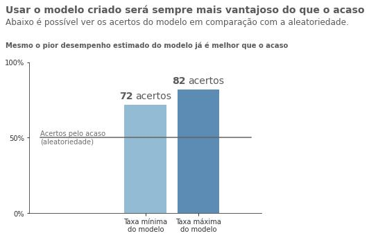

# Resolvendo problema de saída de clientes com Data Science

## Sumário
1. Sobre o problema de negócio abordado
    - Introdução
    - Sobre valores - quantificando o problema
    - A solução proposta: desempenho, desempenho esperado e Lift

2. Desenvolvimento da solução
    - Coleta e acesso aos dados
    - Pré processamento e processamento das informações
    - Colocando o modelo para funcionar - deploy em nuvem

3. Conclusão e considerações

4. Sobre o autor

## Sobre o problema de negócio abordado
### Introdução
Prever a saída de clientes de uma empresa é algo bastante interessante para que melhores resultados sejam alcançados. Ter o **conhecimento sobre a possibilidade de evasão de determinado cliente permite que a empresa busque reconquistá-lo**, mantendo-o presente e consumindo seus produtos e serviços.

**Perder um cliente para a concorrência pode ser um grande prejuízo** individual, já que a empresa perde um comprador. E isso também pode acarretar prejuízos coletivos no geral, como outros clientes saindo também porque outros saíram, por exemplo. Além do mais, um cliente sempre será uma forte forma de propaganda e isso deve ser levado em consideração: resumidamente, cliente contente pode fazer propaganda positiva da empresa para outros e clientes descontentes podem fazer propaganda negativa.


 
Quanto mais se entende esse cenário, mais se compreende também a importância de prever a saída de clientes. Dessa forma, enxergar que um cliente está prestes a sair (com uma estimativa disso em termos probabilísticos também) é de grande relevância e isso pode ser feito com a Ciência de Dados.
Para o problema em questão, iremos imaginar um cenário de uma empresa de crédito, como um banco, por exemplo.

### Sobre valores - quantificando o problema
Utilizando o conjunto de dados disponíveis para este estudo, o qual iremos abordar com mais detalhes mais a frente, temos que:
- O saldo médio mensal de clientes que saem está estimado (com 95% de confiança) entre 7381.18 e 7803.58 dólares. 
- A proporção de clientes que saíram em relação ao total de cliente está estimada entre 16.29% e 24.45% (estimativa feita a partir de 95% de confiança e considerando o maior erro possível, para quando a amostra é pouco representativa).
Se considerarmos que a amostra é do período de um ano e se for considerado também um cenário com a maior evasão possível estimada, tem-se que:


 
Nessas condições:
- Supondo um total de 20.000 clientes, teríamos que 5.000 abandonariam a empresa no ano
- Desses 5.000 que abandonariam, se cada um que sai possui salário entre 7381.18 a 7803.58 dólares, **tem-se então de 36.905.900 a 39.017.900 de dólares a menos em cada mês**.

Portanto, além de investir em novos clientes, investir em manter os que já fazem parte da empresa é de grande relevância.


### A solução proposta
O objetivo inicial desse projeto de Ciência de Dados era de construir uma solução aceitável para prever a saída de clientes antes mesmo de ela acontecer e tal objetivo foi cumprido. Através do uso da Estatística, Modelagem e do Machine Learning, foi desenvolvida uma solução eficiente e também foi implementada na nuvem, com acesso via API.
#### Desempenho observado da solução para os dados utilizados
O modelo apresentou performance agradável com relação aos dados utilizados para teste do mesmo. Basicamente:
- Taxa de acerto médio do modelo: 77%:
    - A cada 100 clientes que saíram da empresa e o modelo não sabia disso, ele acertou de 74 a 77 - Portanto, taxa de falso negativo de, em média, 24%.
    - A cada 100 clientes que não saíram da empresa e o modelo não sabia disso, ele acertou de 75 a 81 - Portanto, taxa de falso positivo, em média, de 22%. 

#### Desempenho esperado da solução no mundo real
A partir dos dados observados na testagem do modelo, algumas informações foram **estimadas** (com grau de confiança de 98% e abordagem de erro conservativa) sobre como o modelo se comportaria quando colocado para funcionar no mundo real, a partir da população a qual a amostra pertence:
- Taxa de acerto esperado para o modelo no mundo real: de 72% a 82%:
- Taxa de ocorrência de falso negativo: 18% a 28%
- Taxa de ocorrência de falso positivo: 15% a 27%

Se imaginarmos uma situação em que os clientes sejam julgados de forma aleatória, ou seja, com a probabilidade *de sair* sendo a mesma de *não sair* (50% pra cada), a precisão seria cerca de 50%, pois o modelo aleatório atribuiria aproximadamente metade delas como "vão sair" e metade como "não vão sair". 

Pensando nisso, pode-se comparar o desempenho do modelo criado com o modelo de aleatoriedade (50% para cada classe):



Vale ressaltar que esses valores são esperados se o modelo for utilizado em um cenário de distribuição amostral semelhante ao que foi utilizado nesse projeto. Por essa razão, deve-se treinar novamente este ou um novo modelo se os dados forem extraídos de outra população.

Supondo que seja possível enviar benefícios para aqueles clientes que estão prestes a sair como tentativa de mantê-los na empresa e, supondo também, que **a cada 100 pessoas que recebem tais benefícios, 30 mudam de ideia e decidem não sair**, temos então que:
- Se for considerado o **acaso** como solução do problema, teríamos 50% de acerto do modelo. Para cada 100 pessoas que sairiam, ele acertaria 50 e, dessas 50, **15 mudariam de ideia (50% x 30% = 15% do total de pessoas analisadas)**.
- Se for considerado o **modelo desenvolvido** como solução do problema, com erro de falso negativo estimado entre 18 a 28%, a cada 100 pessoas que sairiam:
	- Ele acertaria no mínimo 72 e no máximo 82 delas. 
	- Considerando conversão de 30%, tem-se que no mínimo 22 (22% do total) e no máximo 25 (25% do total) pessoas mudariam de ideia 
	
- Portanto, é possível ver que o modelo teria de **7 a 10% a mais de eficiência que o acaso**. Mesmo no cenário de maior taxa de falso positivo estimada para o modelo, temos ainda vantagem de 7% do que com a solução "ao acaso".

#### LIFT esperado
Se 25% das pessoas saem por ano e, como calculado acima, a implementação do modelo faz com que 22% a 25% das pessoas mudem de ideia, tem-se que:
- **No mínimo**, 5.5% das pessoas mudariam de ideia (22% x 25% = 5.5%), o que **faz o abandono cair de 25% para 19.5%**.
- **No máximo**, 6.25% das pessoas mudariam de ideia (25% x 25% = 6.25%), o que **faz o abandono cair de 25% para 18.75%**.

Considerando novamente o número total de clientes em determinado ano como 20.000, teríamos:
- **Redução mínima da evasão de 5.000 para 3.900 clientes.**
- **Redução máxima da evasão de 5.000 para 3.750 clientes.**

Como o salário anual de cada cliente que sai está estimado, em média, como 91.108,56 dólares (7592.38 dólares ao mês):
- Redução mínima de 455.542.800 (salário anual para 5.000 clientes que saíram) para **355.323.384** dólares (para **3.900** clientes que saíram)
- Redução máxima de 455.542.800 (salário anual para 5.000 clientes que saíram) para **341.657.100** dólares (para **3.750** clientes que saíram)

**Portanto, ao utilizar essa solução criada, o banco poderia ter de 100.219.416 a 113.885.700 de dólaras a mais em seus cofres.**
Lembrando que esses valores descritos acima são referentes ao conjunto de **saldo mensal do cliente** (dinheiro que ele coloca no banco mensalmente – seu salário) somado de todos os clientes e refletidos isso ao ano (saldo mensal de todos os clientes x 12).


## Dados usados no desenvolvimento da solução
Algumas informações sobre o conjunto de dados usado estão logo abaixo. Para outras informações mais específicas, acesse o notebook da análise exploratória dos dados na pasta *Notebooks*.

### Coleta dos dados

Os dados para desenvolver a solução proposta foram extraídos [deste](https://www.kaggle.com/datasets/shubh0799/churn-modelling) dataset do Kaggle. As características presentes são:

1. **RowNumber:** The number of the row
2. **CustomerId:** The unique customer id
3. **Surname:** Customers Surname
4. **CreditScore:** Their credit score
5. **Geography:** Which Country they belong to
6. **Gender:** Their Gender
7. **Age:** Age
8. **Tenure:** The time of bond with company
9. **Balance:** The amount left with them
10. **NumOfProducts:** The products they own.
11. **HasCrCard:** Do they have a credit card or not
12. **IsActiveMember:** How active member they are
13. **EstimatedSalary:** Their estimated salary
14. **Exited:** Whether they stay in the or leave


### Preparação do conjunto de dados - o pré processamento

Foi feito todo o pré processamento necessário para melhorar o desempenho da solução. Dessa forma, o pré processamento incluiu:
1. Correção de formato: modelo não aceita variáveis no formato textual
2. Correção de valores nulos: modelo não aceita dados nulos
3. Identificação e remoção de outliers: anomalias atrapalham no desempenho do modelo e devem ser tratadas
4. Feature Engineering: criação de novas variáveis de acordo com o necessário
5. Identificação de normalidade: processo de verificação de curvas normais
6. Normalização e padronização: de acordo com o conhecimento de cada feature, será realizado o ajuste correto


### Processamento - A análise exploratória dos dados

Foi realizado todo o processamento dos dados, verificação de correlações, entendimento dos perfis de análise (clientes que ficam e clientes que saem) e criação do modelo.

### Colocando a solução para funcionar - o deploy na nuvem
Para que fosse possível facilitar o acesso ao modelo, foi desenvolvida uma API em flask e foi feito o deploy do modelo na plataforma *Heroku*. Para utilizar o modelo, basta que seja feita uma **solicitação POST** para o seguinte endereço:

https://vinipilan-churn-model.herokuapp.com/predict

O modelo deve receber via essa solicitação um data frame contendo um ou mais clientes no formato json. As colunas desse data frame são as seguintes (obrigatóriamente nessa ordem):
- CreditScore
- Gender_Male
- Age
- Balance
- NumOfProducts
- HasCrCard
- IsActiveMember
- EstimatedSalary
- Geography_France
- Geography_Germany
- Geography_Spain
- Surname_freq

Ao realizar tal request, será devolvido um data frame (no formato json) com a predição e com a probabilidade estimada de saída para o(s) respectivo(s) cliente(s) enviado(s). Exemplo:
```
[{'CreditScore': 0.5706695005,
  'Gender_Male': 1,
  'Age': 0.4,
  'Balance': 0.32960506,
  'NumOfProducts': 0.0,
  'HasCrCard': 1,
  'IsActiveMember': 0,
  'EstimatedSalary': 0.3742518722,
  'Geography_France': 1,
  'Geography_Germany': 0,
  'Geography_Spain': 0,
  'Surname_freq': 0.1016949153,
  'Prediction': 0,
  'Prediction_prob': 0.22}]
```

## Conclusão e considerações

Para o problema abordado foi desenvolvida uma solução utilizando Data Science e Machine Learning. Como foi apresentado nesse documento, a solução apresenta ganho significativo para a empresa e, por ser facilmente implementada, é também bastante viável.

A implementação via nuvem (com API) feita possibilita que essa solução seja utilizada em larga escala. Vale ressaltar que os dados foram retirados de um data set do Kaggle e por isso eles foram considerados nesse estudo como uma amostra pouco representativa. Dessa forma, foi estimado o pior erro possível para criar as conclusões de desempenho. 

Para uso eficiente da solução, ela deve ser construída com dados referentes a empresa. A solução feita aqui é apenas uma demonstração de conhecimento para portifólio.


## Sobre o autor
Me chamo Vinícius de Paula Pilan e sou estudante da área de dados. Busco alcançar autoridade nessa área e me tornar um cientista de dados profissional.

Tenho conhecimento teórico e prático sobre os principais conceitos de estatística, modelagem e ciência de dados. Meu currículo completo, minhas certificações, experiências, meus projetos e formas de contato podem ser acessadas através do meu site:

https://sites.google.com/view/vinicius-pilan/

Atualmente, sou estudante de Ciência da Computação na universidade estadual paulista UNESP, no campus de Bauru, e busco uma oportunidade para me desenvolver profissionalmente.
